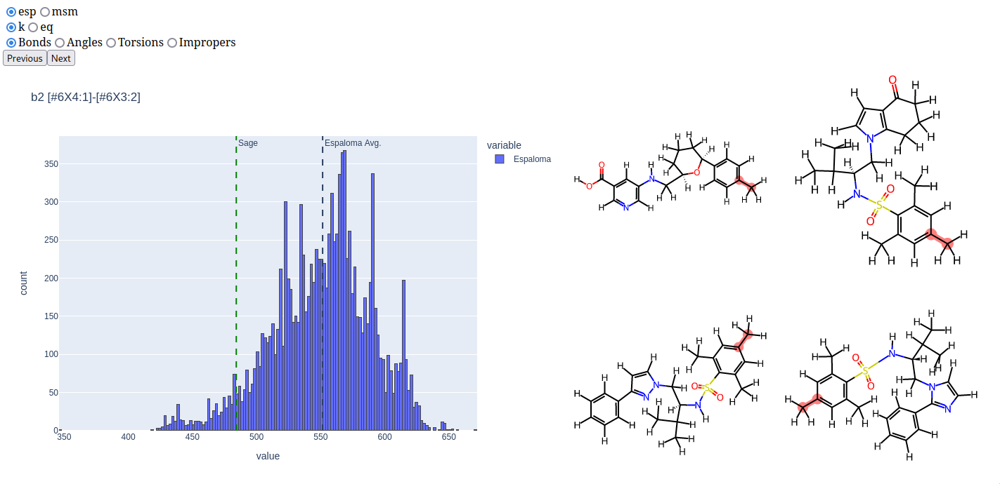
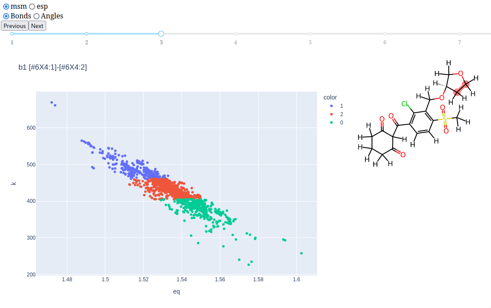

# lipoma
Literally Interpreting esPalOMA parameters

# Usage

``` shell
mamba env create -f env.yaml
```

If you want to run the dashboard (`python board.py`), you also need to generate
the data files. This can be done simply with `make`:

``` shell
make
```

This runs the default `all` recipe, which in turn runs the following commands to
generate the JSON files read by the dashboard.

``` shell
python query.py -d datasets/industry.json -o data/industry
python query.py -d datasets/industry.json -o data/industry -f
python msm.py -d datasets/filtered-opt.json -o data/msm
```

Then you can run the histogram dashboard with this command:

``` shell
python board.py
```

This yields plots like that shown below, where you can click on bars in the
histogram to display the corresponding molecules at the right.



There is also a dashboard with 2D plots of equilibrium values and force
constants together. Run this one with

``` shell
python twod.py
```

This produces a dashboard like the one shown below, where the slider allows you
to select the number of KMeans clusters depicted in the graph, and clicking on
data points again displays the corresponding molecule.


